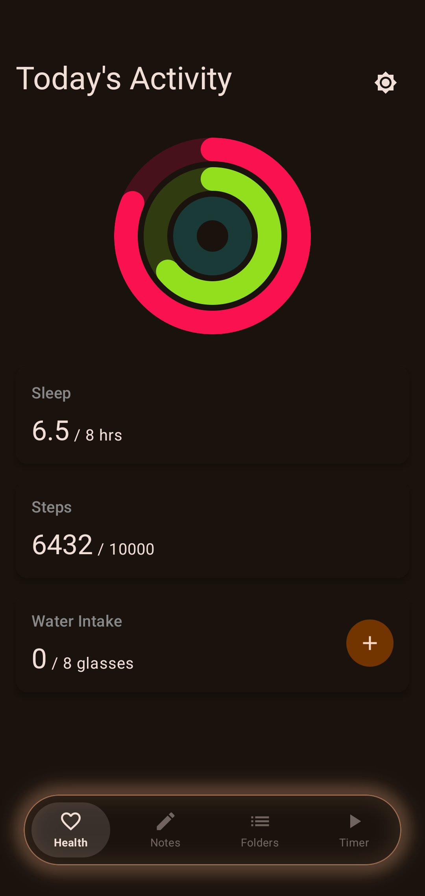
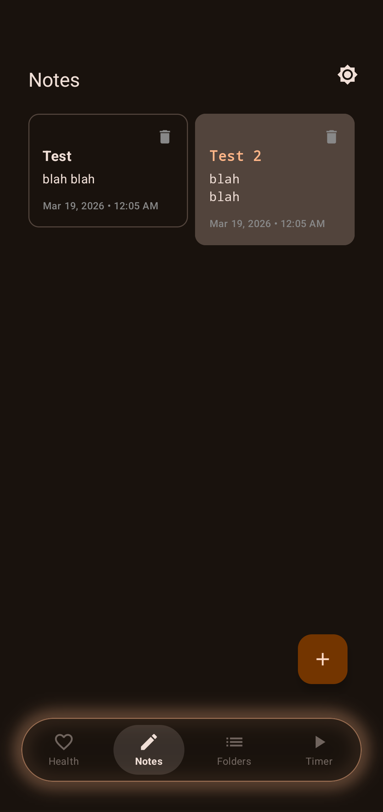
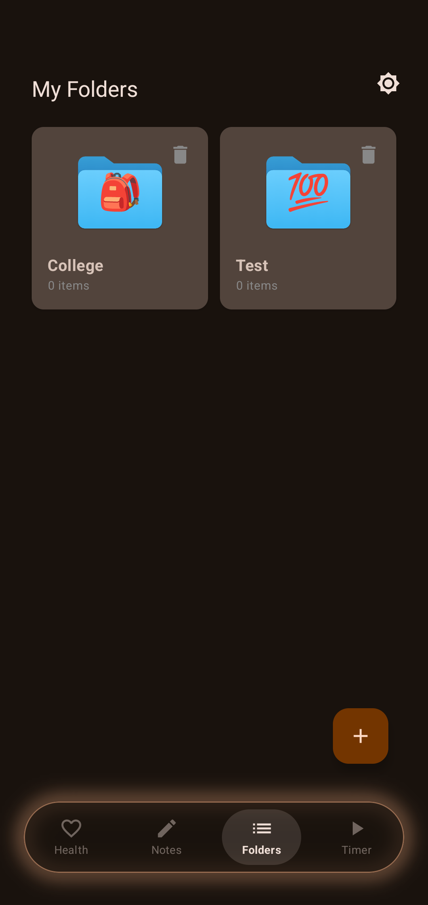
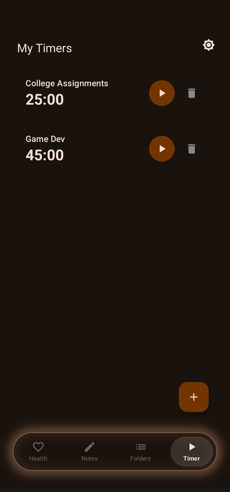

# ActivityApp 🚀

[](https://github.com/weeeol/ActivityApp/actions/workflows/android.yml)
[](https://kotlinlang.org)
[](https://developer.android.com/jetpack/compose)
[](https://m3.material.io/)
[](LICENSE.txt)

A modern, high-performance Android productivity and lifestyle tracking application built entirely with **Kotlin** and **Jetpack Compose**. ActivityApp combines developer-focused note-taking, project organization, time management, and health tracking into a single, beautifully animated interface with 120Hz high refresh rate support and spring-physics interactions.

---

## 📱 Screenshots

<p align="center">
  
  
  
  
</p>

---

## ✨ Key Features

### 📝 Developer-Focused Notes
* **Code Mode:** Toggle a specialized editing mode with line numbers, monospaced font, and clean code formatting.
* **Live Syntax Highlighting:** Real-time multi-color syntax highlighting for keywords, strings, numbers, and comments.
* **Active Word Tracking:** Tapping any variable or word instantly highlights all matching occurrences across the note.
* **Color Themes & Pinning:** Tag notes with Apple-style pastel accent swatches and pin important notes to the top.
* **Staggered Grid:** A fluid, Google Keep-style staggered grid with spring press feedback.

### 📁 Smart Folder Organization
* **Custom Folders:** Categorize and organize notes into distinct project spaces.
* **Emoji Badging:** Choose from presets or customize folder icons with live emoji badges.
* **Cascade Management:** Clean cascade handling when folders and notes are organized or removed.

### ⏱️ Advanced Timers
* **Quick Presets:** Rapidly create timers with predefined duration chips and activity tags (Work, Study, Workout, etc.).
* **Scheduled Starts:** Schedule timers to trigger automatically at specific times using device clocks.
* **Active Breathing Pulse:** Running timers feature an ambient breathing glow with spring-animated circular progress.

### ❤️ Health & Activity Dashboard
* **Activity Rings:** Canvas-drawn Apple-style animated progress rings for Sleep, Steps, and Hydration with spring intro physics.
* **Step Counting:** Hardware step sensor integration with real-time goal calibration.
* **Celebration Fireworks:** Reaching milestones triggers a 2D particle celebration.

### 🎨 Fluid Gesture-Driven UI & 120Hz Support
* **Interactive Navigation Pill:** Fluid drag-to-slide indicator with haptic feedback, spring snapping, and icon state morphing (filled when selected, hollow when unselected).
* **Hardware RenderNode Pipeline:** Full-page transitions run via pure `.graphicsLayer` translations for hitch-free 120fps swiping.
* **Spring Sheet Settings:** Smooth slide-up settings modal with theme switcher and goal preferences.

---

## 🛠️ Tech Stack & Architecture

* **Language:** [Kotlin 2.4.10](https://kotlinlang.org/)
* **UI Toolkit:** [Jetpack Compose](https://developer.android.com/jetpack/compose) with Material Design 3 (MD3)
* **Architecture:** MVVM (Model-View-ViewModel) with Kotlin Coroutines & `StateFlow`
* **Local Database:** [Room 2.8.4](https://developer.android.com/training/data-storage/room) via KSP code generation
* **Preferences & Serialization:** `SharedPreferences` with `Gson`
* **Build System:** Gradle Kotlin DSL (`build.gradle.kts`) with Version Catalogs (`gradle/libs.versions.toml`)

---

## 🚀 Getting Started

### Prerequisites
* Android Studio Ladybug | 2024.2+ (or newer)
* JDK 17 or JDK 21
* Minimum SDK: API 26 (Android 8.0)
* Target SDK: API 36 (Android 15+)

### Installation
1. Clone the repository:
   ```bash
   git clone https://github.com/weeeol/ActivityApp.git
   cd ActivityApp
   ```
2. Open the project in Android Studio.
3. Allow Gradle to sync dependencies.
4. Run on a device or emulator:
   ```bash
   ./gradlew installDebug
   ```

---

## 🧪 Testing & Verification

Run local unit tests:
```bash
./gradlew test
```

Assemble debug build:
```bash
./gradlew assembleDebug
```

---

## 📄 License

This project is licensed under the terms of the GNU General Public License v3.0 - see the [LICENSE.txt](LICENSE.txt) file for details.